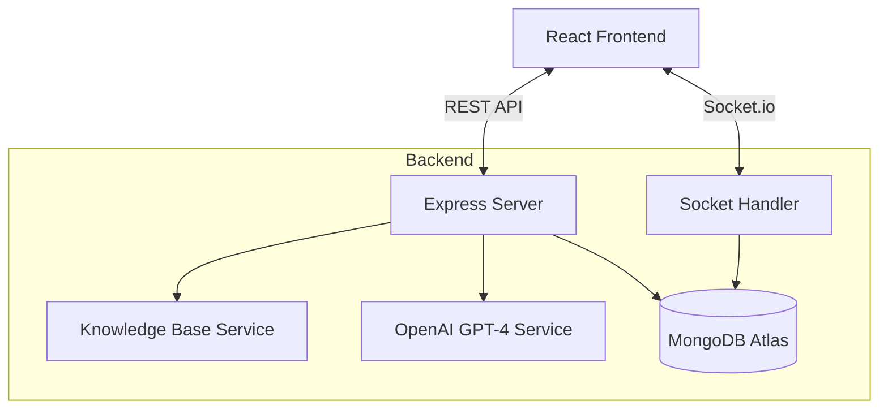

# 🤖 AI-Powered Customer Support Chatbot

A modern, full-stack AI chatbot with real-time messaging, smart knowledge base, GPT-4 fallback, and analytics dashboard.


## 📌 Project Overview

This is a real-time AI-powered customer support chatbot designed to handle customer queries efficiently. It features context-aware responses, a knowledge base for instant answers, and a GPT-4 fallback for complex queries. The system is built with a scalable architecture using React, Node.js, Socket.io, and MongoDB.

## 🏗️ Architecture Diagram



## 🚀 Key Features

*   **Real-time Messaging**: Instant communication using Socket.io.
*   **AI Intelligence**: GPT-4 fallback for complex queries context tracking (last 6 messages).
*   **Analytics Dashboard**: Track response times, AI fallback rates, and top queries.
*   **Modern UI**: Attractive Indigo/Cyan theme with Framer Motion animations.
*   **Resilient**: Error handling and "Server disconnected" states.

## 🛠️ Environment Variables

### Backend Configuration

Create a `.env` file in the `backend` directory:

```env
# Database
MONGO_URI=mongodb+srv://<username>:<password>@cluster0.mongodb.net/chatbot

# AI Configuration
OPENAI_API_KEY=sk-...

# Application Settings
PORT=5000
FRONTEND_URL=http://localhost:5173
```

### Frontend Configuration

Create a `.env` file in the `frontend` directory:

```env
# Backend API URL
VITE_API_URL=http://localhost:5000

# Socket.io URL
VITE_SOCKET_URL=http://localhost:5000
```

**For Production Deployment:**
- Set `VITE_API_URL` and `VITE_SOCKET_URL` to your deployed backend URL
- Example: `https://your-backend-name.onrender.com`
- Configure these as environment variables in your hosting platform (Vercel/Render)

## 📚 API Endpoints

| Method | Endpoint | Description |
|--------|----------|-------------|
| **POST** | `/api/chat/message` | Send a message and get a reply (Standard HTTP) |
| **POST** | `/api/chat/session` | Initialize a new session |
| **GET** | `/api/analytics` | Retrieve dashboard metrics |

## 🎤 How to Explain This in an Interview

> "I designed a real-time AI-powered customer support chatbot with context-aware responses, knowledge-base matching, and GPT-4 fallback. The system uses Socket.io for live chat, MongoDB for conversation persistence, and an analytics dashboard to track performance metrics."

**This project demonstrates:**
*   ✅ **Full-stack skills** (React + Node.js)
*   ✅ **AI Integration** (OpenAI API + Context Management)
*   ✅ **Real-time Systems** (WebSockets)
*   ✅ **Scalable Architecture** (Separation of concerns)
*   ✅ **Clean UI/UX Thinking** (Modern Design System)

## 🚢 Deployment Guide

| Component | Platform | Strategy |
|-----------|----------|----------|
| **Frontend** | Vercel | Connect GitHub repo, auto-deploy on push. |
| **Backend** | Render/Railway | Deploy as Node.js web service. |
| **Database** | MongoDB Atlas | Use free tier cluster. |

## 📸 Screenshots

*(Add screenshots of the chat interface and analytics dashboard here)*

---
*Built for the Modern Web.*
